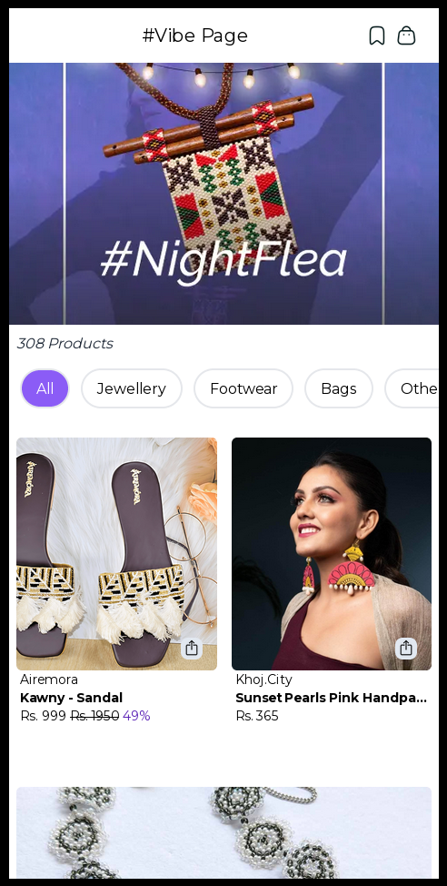
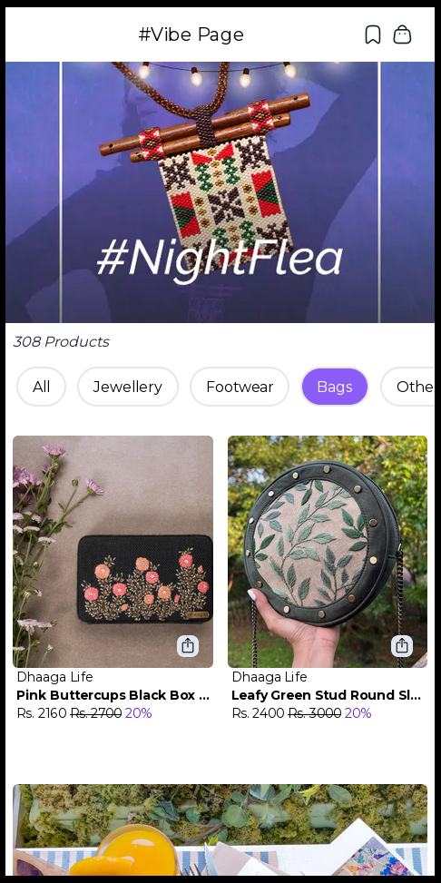
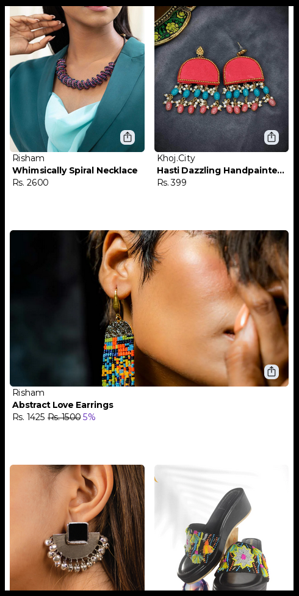
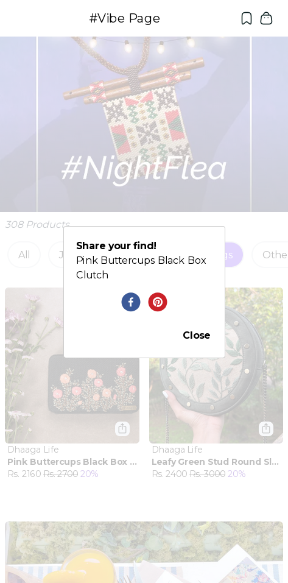

# [Store App](https://store-fp.vercel.app/)
## Furrl - Vibe Store

A store app built with Typescript, Nextjs and Tailwindcss. It is deployed on Vercel.

Built for the mobile, so make sure to use "responsive view" of your browser when on desktop. 

### Main Page

The "Night Flea" vibe page of the Furrl store.

### Filters

Customers can select various categories of products they are interested in.

### Infinite Scroll

New products are automatically loaded as customers scrolls through the product catalog. 

### Share Menu

Customer can share products they are interested in. 

