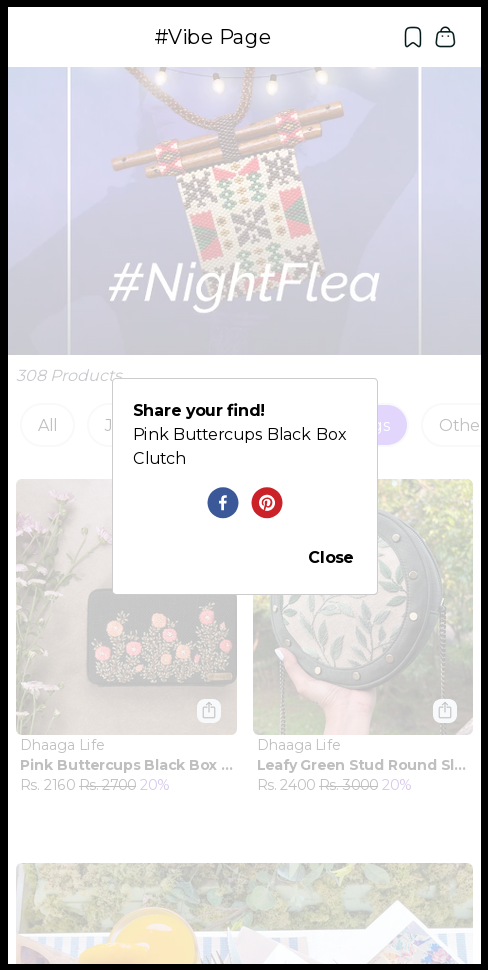

# Store App: Furrl @ Vibe

A store app built with Typescript, Nextjs and Tailwindcss. It is deployed on Vercel.

## Main Page

The "Night Flea" vibe page of the Furrl store.

## Filters

Customers can select various categories of products they are interested in.

## Infinite Scroll

New products are automatically loaded as customers scrolls through the product catalouge. 

## Share Menu

Customer can share products they are interested in. 

